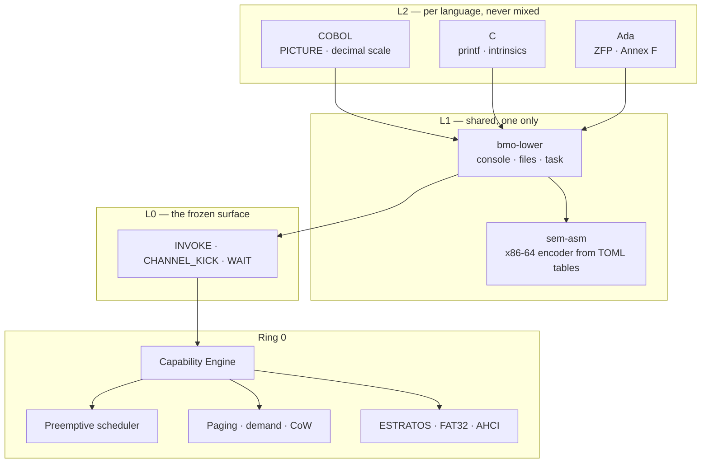

# BMO-X

**A bare-metal orchestrator that boots on real hardware and runs COBOL, C and
Ada — compiled by its own toolchain. No LLVM. No GCC. No QEMU.**

Written from scratch in Rust — the boot chain, the kernel, the drivers, the
filesystem, and three native compilers. It boots on an AMD Ryzen 5 5600X and
occupies **5.4 MiB of 14.8 GiB of RAM**.

**942 commits · 486 files · 17 April – 31 July 2026 · one developer.**

<!-- TODO Eddi: enlace al video -->
▶ **[Watch it boot and run a banking batch job (90s)](VIDEO_URL_AQUI)**

---

## Read this first: the three states

Everything in this document is labelled with one of three states, and mixing
them up is how projects lie about themselves.

| | State | Meaning |
|:--:|---|---|
| 🟢 | **Runs on metal** | Seen working on the real Ryzen, with a photo or a telemetry line |
| 🟡 | **Written, never executed** | Compiles, links, passes its tests — and no CPU has ever run it |
| ⚪ | **Design only** | Documented, not built |

**Only 🟢 counts as done.** Nothing here is marked green because it should
work.

---

## Where this came from

BMO-X was never designed for banking. It was designed as something closer to a
**games console**: a bare-metal system minimal enough to get out of the way of
a graphics stack I intended to write myself.

That plan died for a specific technical reason, and the reason is the whole
architecture in miniature. **BMO-X squeezes hardware using the documentation
each manufacturer publishes.** AMD publishes its GPU instruction set. NVIDIA
does not. I own an NVIDIA card. So the design principle itself said no — not
resignation, just the method returning an answer I didn't like.

What survived the graphics stack was the part underneath: exact decimal
arithmetic, a tiny kernel, and total control over emitted machine code. That
turned out to be precisely what banking software has needed for sixty years.

The project kept the minimalism and changed the destination.

---

## This is not an operating system

Windows and Linux sell **compatibility** — run anything, reasonably well. That
race is thirty years old and already won.

BMO-X sells the opposite: **specialization**. Run one thing, exactly, and be
able to prove it. There is no distro planned, because distros already exist and
that is not the contest.

It will never open a web browser. Neither will an ATM, a payment terminal, a
flight computer, or the machine that closes a bank's books at midnight. Some
computers exist to do one thing, correctly, for twenty years. That is the
category this belongs to, on purpose.

---

## Why these three languages

Not nostalgia. Each one is there for a reason, and all three compile to the
same binary format.

| Language | Why it is here |
|---|---|
| **COBOL** | Money. Exact decimal arithmetic is not a feature you add to a language — it has to go all the way down to the emitted instructions. COBOL is where that requirement was born, and it is still running the world's banks. |
| **C** | Control. C is the neutral tool — its job is to not get in the way. It is what the system itself is written in when Rust is the wrong altitude, and it is what an outside team reaches for first. |
| **Ada** | Safety. Ada exists so a value out of range is *detected* rather than silently wrapped. And Annex F copied COBOL's `PICTURE` rules in 1985 — so the exact decimal work was already paid for. |

**BEF** is the binary format all three produce. The system's entry gate never
asks which language a binary came from. That is what makes three frontends one
product instead of three.

---

## Architecture

**Three doors, and never a fourth.** Everything else is a *subsyscall*: an
operation on a capability. The screen, keyboard, console, directories, files,
RPC endpoints and program launching were all added without opening a new door.
No root, no ambient authority, no `chmod` — a process touches only what it was
explicitly handed.

---

## 🟢 Running on real hardware

**Kernel**
- Unified UEFI boot chain — the bootloader carries both stages and the kernel
  inside; nothing is read from firmware
- Preemptive scheduling by LAPIC timer, with real Ring 0 ↔ Ring 3 switching
- Capability engine, 16 processes × 64 slots, generation counters against
  use-after-free
- Per-task `XSAVE`, 4-level paging with demand paging and copy-on-write
- A fault in Ring 3 kills the task and the system keeps going

**Drivers, all written from scratch**
- USB keyboard (xHCI + HID) — Spanish and US layouts, dead keys, AltGr, key
  repeat, LEDs, history
- AHCI/SATA, GPT, FAT32 — the kernel reads and mounts its own disk
- The boot volume is mounted read-only. That is structural, not a promise

**Compilers**
- COBOL: `PICTURE` editing emitted as instructions, file I/O, `OCCURS` with
  range guards, level 88
- C: through roughly C11 — pointers, structs by value, initializer lists,
  function-parameter macros, SSE floats, `getchar`/`scanf`
- Ada: ZFP profile, `delta`/`digits` decimal types, real operator precedence

**And the number that matters:** `19.99 × 3 = 59.97`, exact, computed in
integer scale and confirmed on silicon.

---

## 🟡 Written, never executed on a CPU

Listed here rather than above, because the difference is the entire point.

- **ESTRATOS writes** — the transaction state machine exists and is tested;
  nothing has wired it to the device yet
- **Framebuffer write-combining** (PAT) — cheap, and every pixel will feel it
- **SMP** — the code to wake the other cores exists and nothing calls it.
  Deliberately last: the day a second core runs, every `static mut` in the
  kernel is a race
- **Mouse event ring** — enumerates and delivers, the shared ring fix is
  waiting on a photo

---

## ⚪ Designed, not built

- ESTRATOS garbage collector — policy is written: the owner decides, named
  strata are never released, read-only at 95% rather than lose data
- Memory capability — unlocks garbage-collected languages and shared surfaces
  at the same time
- Windows with shared surfaces

---

## ESTRATOS — writing *is* committing

A copy-on-write, content-addressed filesystem where nothing is overwritten.
Every write leaves a layer above the last, so reading backwards in time means
descending through the strata.

Git stores blobs, trees and commits. A copy-on-write filesystem stores blocks,
nodes and superblocks. They are the same shape — Unix never unified them, so
Git had to live on top with a `.git/` that duplicates everything.

BLAKE3 checksums live in the *pointer*, not the block, so the Merkle tree comes
free. Signatures are verified before a binary becomes executable.

🟢 mounts and reads on real hardware · 🟡 writing is the next step

---

## How it is verified

The compilers are tested by a **conformance matrix that executes the emitted
machine code** and checks real output — not by comparing against hand-written
byte strings. An `IF` that fails to branch looks identical to a working one in
a byte dump; the only way to tell them apart is to run them.

Adding a feature to a compiler means adding its row to the matrix. That is why
there are no percentages on this page: a percentage needs a denominator, and
the COBOL standard doesn't have one.

**The order of authority is written down and enforced:**

1. The real Ryzen
2. The specification document
3. The emulator

When the emulator and the hardware disagree, *the emulator gets fixed*. That
rule caught a broken `lea [rip+disp]` that passed green in simulation and would
have read garbage on real silicon.

Unimplemented features are **rejected with a reason**, never stubbed to look
like they work.

---

## What it deliberately does not do

Stated plainly, because promising compatibility that doesn't exist is how the
previous attempt died.

- No Vulkan or GPU driver — another project this size, and the documentation
  isn't published for the card I own
- No Wine or Win32 — thirty years of work for compatibility this goal does not use
- No complete libc, no POSIX personality
- No networking stack, no browser

These are decisions, not gaps. They are decisions **of this phase** — the day
games come back, the unlock is already on the roadmap: memory capability →
shared surfaces → windows.

---

## Roadmap

1. **Wire ESTRATOS writes to the device** — the only thing between "a store you
   can read" and "a store"
2. **COMP-3 (packed decimal)** — the format real bank data is actually stored in
3. **Range checks in Ada** — without them it is Ada syntax with C safety
4. **Memory capability** — unlocks GC languages and shared surfaces at once
5. **Framebuffer write-combining**
6. **SMP, last** — the trampoline is 10%; auditing shared state is the other 90%

---

## Why this is opening up

Not ideology. A practical limit: **specializing for a manufacturer requires
hardware, and I own one machine.**

BMO-X squeezes each component using the documentation its manufacturer
publishes. That approach works — and it costs one set of tables plus one real
machine per target, forever. I cannot buy an Intel, an ARM, a RISC-V and a
Zen 5 to verify against. Other people already have them running.

So the parts that let you port travel outward. The Base does not move.

---

## License

[Techne License v2.0](LICENSE.txt) — free for individuals, students, research,
open source, nonprofits, and companies under USD $1M/year. Commercial use above
that is a published rate, not a negotiation.

**The source is public.** All of it — read it, build it, audit it, no
permission and no signature required. No hidden modules, no binary blobs
without source.

Public is not public domain, and not OSI open source. The rights stay with the
author and commercial use is licensed — the same shape MariaDB and Elastic use.
**Looking is free. Charging is not.**

The reasoning is simple: a system aiming at banking and critical sectors cannot
ask to be trusted. It has to be checkable. And what protects the author is the
licence and copyright, which work identically with the code in plain sight.

The kernel is a floor, not a fork point: the three-syscall surface and the BEF
format stay fixed, so **one audit serves everyone**. Everything above it —
applications, drivers, table-driven mods, new instructions, new languages,
ports to other CPUs — is open ground.

---

## Going deeper

- **[ARQUITECTURA.md](ARQUITECTURA.md)** — the full technical document: layout,
  boot path, the subsyscall table, the memory allocator, and the complete
  status list
- **[BITACORA.md](BITACORA.md)** — the build log, episode by episode. Every bug
  that cost a day is written down with its root cause
- **[AVANCES.md](AVANCES.md)** — index of what is done and what is waiting for a
  boot

---

Built from scratch in Lima, Peru, by **Eddi Salazar**.

<!-- TODO Eddi: enlaces a tu web, correo y al video -->
