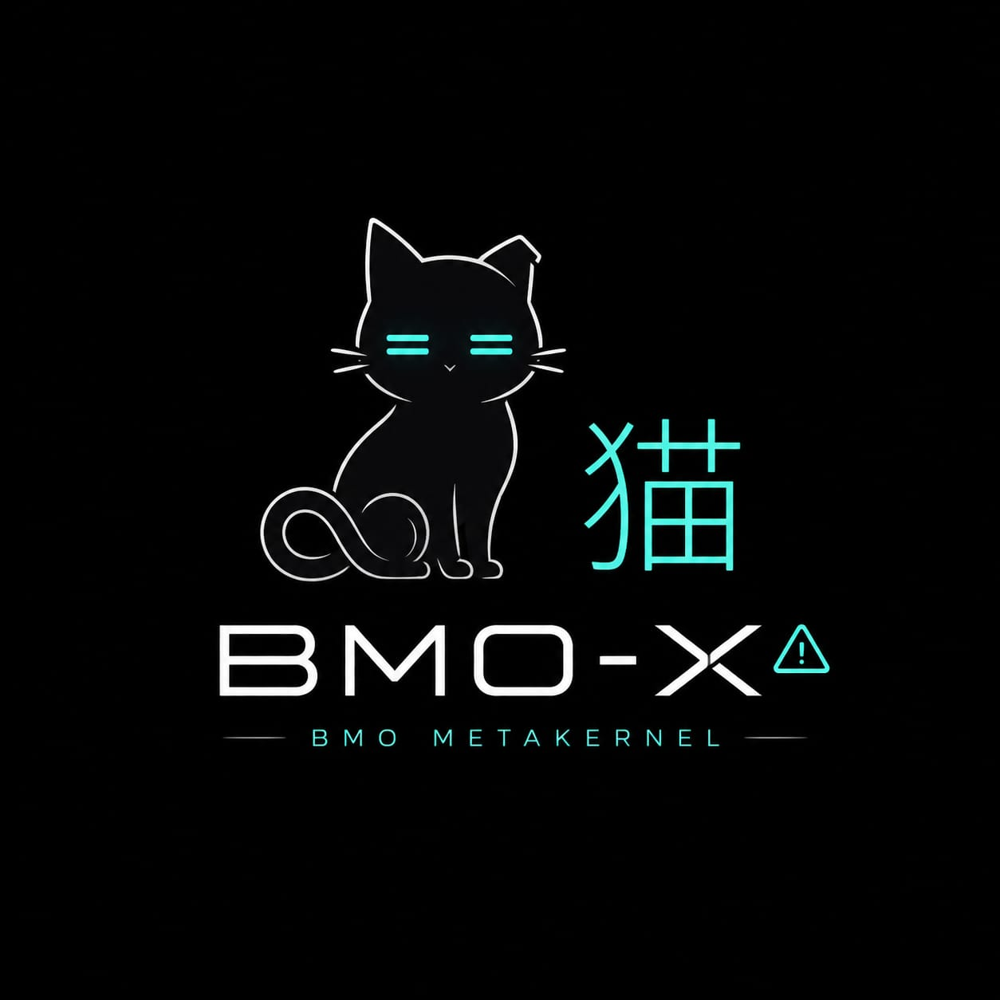

  

# BMO-X

**A bare-metal orchestrator that boots on real hardware and runs COBOL, C and
Ada -- compiled by its own toolchain. No LLVM. No GCC. No QEMU.**

Written from scratch in Rust -- the boot chain, the kernel, the drivers, the
filesystem, and three native compilers. It boots on an AMD Ryzen 5 5600X and
occupies **5.4 MiB of 14.8 GiB of RAM**.

**1.279 commits - 702 files - 17 April to 13 August 2026 - one developer.**

---

## The one sentence

**Authority is functional, never inherited.** What a process may do comes from
the handles it holds -- not from who launched it, what it is called, or which
user is logged in. There is no `root` to inherit from and no ambient permission
to escalate into.

The teller's process does not *fail a check* on a large transfer. **The
operation does not exist for it.**

Everything below is a consequence of that sentence, and the four other clauses
that follow from it are in **[ARQUITECTURA.md](ARQUITECTURA.md)** with the
mechanism that implements each one -- because a principle with no mechanism
under it is a slogan.

---

## Read this first: the three states

| | State | Meaning |
|:--:|---|---|
| 🟢 | **Runs on metal** | Seen working on the real Ryzen, with a photo or a telemetry line |
| 🟡 | **Written, never executed** | Compiles, links, passes its tests -- and no CPU has ever run it |
| ⚪ | **Design only** | Documented, not built |

**Only 🟢 counts as done.** Nothing is green because it *should* work.

---

## 🟢 What the silicon has actually done

| | |
|---|---|
| Boots UEFI -> Ring 0 -> Ring 3 | kernel up at **47 ms**, first composed frame at **1.210 ms** |
| Runs its own compilers' output | COBOL, C and Ada binaries, launched from disk |
| Decimal arithmetic that is exact | a bank batch totalling `$1,135.00` from a file it read |
| USB keyboard and mouse | xHCI + HID written here, no BIOS help |
| Disk | AHCI, FAT32 read *and* write, plus ESTRATOS, its own copy-on-write volume |
| 12 cores | SMP bring-up, `12 of 12` |
| Ring 3 isolation | a fault kills the task; the kernel takes the screen back and prints its last four lines |

**The rescue that makes the rest safe**: `Ctrl+Alt+ESC` returns keyboard *and*
screen to the kernel from any program, checked at the one point in Ring 0 every
key passes through. A program that holds both cannot keep the machine hostage --
whether the cause is malice or a missing `if`.

Photographs, telemetry and the exact dates: **[AVANCES.md](AVANCES.md)**.

---

## Why it is built this way

Five decisions carry the whole design. Each is stated with what it costs,
because a trade-off with only one side written down is advertising.

**Two syscalls, frozen.** `INVOKE` and `WAIT`. Everything else -- opening a file,
reading the mouse, claiming the screen -- is an *operation* on a capability. The
API grows inside the pair (object kind, operation); the ABI does not move. The
proof it works is a number: **the operations went 22 -> 40 while the doors went
3 -> 2.** The system grew and the surface shrank.
*Cost*: every new ability needs a handle kind to hang from, so there is no quick
way to add "just one syscall".

**Its own compilers.** COBOL, C and Ada, straight to machine code and BMO's own
`.bex` container. No LLVM, no libc, no linker.
*Cost*: every bug in every language is ours, and a missing corner of C is found
by a program that dies, not by a spec.

**An abstraction may save you work; it may not lie.** An unimplemented feature is
**rejected with a reason, never stubbed to look like it works**. A global the
compiler cannot evaluate is an error rather than a silent zero. When `info`
reports 8.4 MiB, that number comes from the kernel and not from the program
claiming it.
*Cost*: more paths that say no, and more code to say why.

**Writing *is* committing.** ESTRATOS is copy-on-write: the audit trail is not a
logging product bolted on, it is what the filesystem leaves behind. The write
window is **named, per volume**, and the owner's Windows loader is outside every
one of them.
*Cost*: space, and a sealing step that has to be deliberate.

**Survive the fall.** A cat falls, breaks something, and walks away. Not the
absence of failure -- surviving it and being able to say what happened.
*Cost*: the kernel carries autopsy machinery it hopes never to use.

---

## What it deliberately does not do

No networking stack, no GPU driver, no dynamic linking, no processes talking
over sockets, no package manager, no accounts. Some of those are queued and some
are refused; **[ARQUITECTURA.md](ARQUITECTURA.md)** says which is which and why.

It is also not a Linux, not a hobby OS aiming at POSIX, and not trying to run
anybody else's binaries. A program for BMO-X is compiled for BMO-X.

---

## How to be suspicious of it

The claim worth checking is not "it works" -- it is that the things marked 🟢
were seen on the real machine and the things marked 🟡 say so.

- `Ultra_kernel_x86-64\build.ps1 -BuildOnly` builds everything and runs the
  guards: sources are ASCII, and the syscall contract is compared across the
  kernel, the ABI and the userland runtime -- 49 operations, none by hand.
- `cargo test --workspace --exclude bmo-kernel` -- **1.130 tests**.
- `cargo test -p bmo-c-front probe_` -- **nine axes, 143 cells, half a second**:
  the census of what the C compiler actually supports, including the rows that
  are still broken. A census that hides its red rows is worth nothing.

**[CONTRIBUTING.md](CONTRIBUTING.md)** explains the bar for a change, and it is
mostly one rule: nothing that compiles and does not do what it says.

---

## Going deeper

This README is the summary on purpose. Everything under it has a document,
because the reason a decision was made is worth more than the decision.

| Document | What is in it |
|---|---|
| **[META-KERNEL_HARD.md](META-KERNEL_HARD.md)** | The law of the machine. A rule exists only if it carries the component that demands it and the number it demands |
| **[META-APP_HARD.md](META-APP_HARD.md)** | The law of an app. What BMO-X demands of anything that wants to be one, and what it gives back |
| **[META-SDK_HARD.md](META-SDK_HARD.md)** | The law of **REX**: the nine `<bmo/...>` headers an app is written with, and the two tests that keep a library from becoming a framework |
| **[ARQUITECTURA.md](ARQUITECTURA.md)** | The full technical picture: layout, boot path, the operation table, the allocator, the complete status list |
| **[BITACORA.md](BITACORA.md)** | The build log, episode by episode. **Every bug that cost a day is written down with its root cause** |
| **[AVANCES.md](AVANCES.md)** | What is done, what is waiting for a boot, and the photographs |
| **[CONTRIBUTING.md](CONTRIBUTING.md)** | The bar, and what is frozen |
| [Ultra_kernel_x86-64](Ultra_kernel_x86-64/README.md) | Ring 0: boot chain, drivers, filesystems |
| [Ultra_userspace](Ultra_userspace/README.md) | Ring 3: the runtime and the compositor |
| [toolchain](toolchain/README.md) | The three compilers and the shared backend |
| [platform](platform/README.md) | The ABI, the `.bex` container, the drivers as crates |
| [docs/](docs/) | The master plans: audio, network, SMP, self-healing, DOOM, RAM |

---

## License

**Techne v2.0.** Read it before assuming: it is not MIT and it is not GPL.
See **[LICENSE.txt](LICENSE.txt)**.

---

Built from scratch in Lima, Peru, by **Eddi Salazar**.

<!-- TODO Eddi: enlaces a tu web, correo y al video -->
