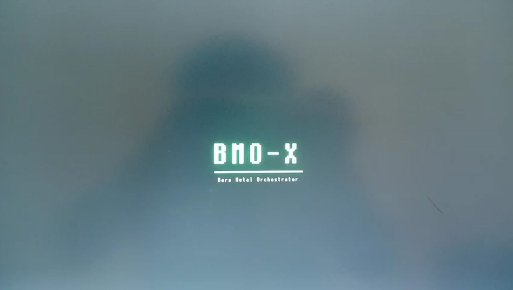
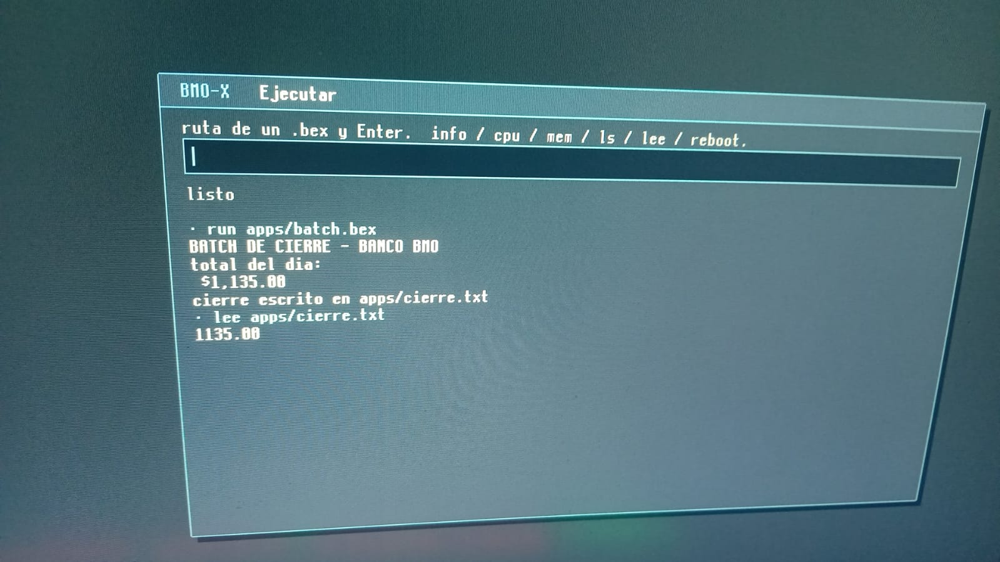
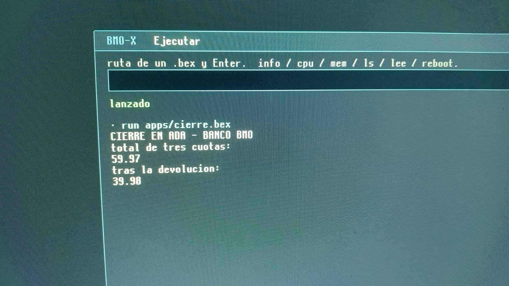
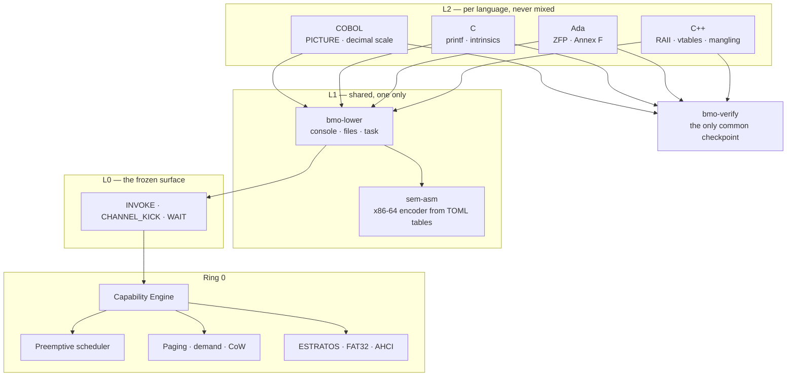

# BMO-X

**A bare-metal orchestrator that boots on real hardware and runs COBOL, C and
Ada — compiled by its own toolchain. No LLVM. No GCC. No QEMU.**


Written from scratch in Rust — the boot chain, the kernel, the drivers, the
filesystem, and three native compilers. It boots on an AMD Ryzen 5 5600X and
occupies **5.4 MiB of 14.8 GiB of RAM**.

**950+ commits · 490+ files · 17 April – 2 August 2026 · one developer.**

---

## Proof, before anything else

Photographs of the machine, not screen captures — the claim is that this is not
an emulator, and a screen capture cannot prove that.

**It is a boot entry on real firmware**, next to Windows, on physical disks:



**A COBOL banking batch: reads transactions, totals them, writes the close to a
file — and reads the file back:**



```
BATCH DE CIERRE - BANCO BMO
total del dia:
 $1,135.00                      ← edited PICTURE, emitted as instructions
cierre escrito en apps/cierre.txt
lee apps/cierre.txt
 1135.00                        ← it really landed on disk
```

**And the same exact decimal from Ada — `19.99 × 3 = 59.97`, in integer scale,
no floating point anywhere:**



**And on 2 August 2026 those same programs were launched from the desktop
itself** — `run cobol/banco.bex` and `run ada/cierre.bex`, typed into the Ring 3
command box, with their output landing in its grid. The languages stopped being
something the kernel embedded and became something the operating system runs.

**More, including C, the desktop, the system report and fault recovery caught as
it happened: [docs/evidencia/](docs/evidencia/)**

<!-- TODO Eddi: enlace al video en YouTube -->

---

## Read this first: the three states

Everything in this document is labelled with one of three states, and mixing
them up is how projects lie about themselves.

| | State | Meaning |
|:--:|---|---|
| 🟢 | **Runs on metal** | Seen working on the real Ryzen, with a photo or a telemetry line |
| 🟡 | **Written, never executed** | Compiles, links, passes its tests — and no CPU has ever run it |
| ⚪ | **Design only** | Documented, not built |

**Only 🟢 counts as done.** Nothing here is marked green because it should
work.

---

## Where this came from

BMO-X was never designed for banking. It was designed as something closer to a
**games console**: a bare-metal system minimal enough to get out of the way of
a graphics stack I intended to write myself.

That plan died for a specific technical reason, and the reason is the whole
architecture in miniature. **BMO-X squeezes hardware using the documentation
each manufacturer publishes.** AMD publishes its GPU instruction set. NVIDIA
does not. I own an NVIDIA card. So the design principle itself said no — not
resignation, just the method returning an answer I didn't like.

What survived the graphics stack was the part underneath: exact decimal
arithmetic, a tiny kernel, and total control over emitted machine code. That
turned out to be precisely what banking software has needed for sixty years.

The project kept the minimalism and changed the destination.

---

## This is not an operating system

Windows and Linux sell **compatibility** — run anything, reasonably well. That
race is thirty years old and already won.

BMO-X sells the opposite: **specialization**. Run one thing, exactly, and be
able to prove it. There is no distro planned, because distros already exist and
that is not the contest.

It will never open a web browser. Neither will an ATM, a payment terminal, a
flight computer, or the machine that closes a bank's books at midnight. Some
computers exist to do one thing, correctly, for twenty years. That is the
category this belongs to, on purpose.

---

## Why these three languages

Not nostalgia. Each one is there for a reason, and all three compile to the
same binary format.

| Language | Why it is here |
|---|---|
| **COBOL** | Money. Exact decimal arithmetic is not a feature you add to a language — it has to go all the way down to the emitted instructions. COBOL is where that requirement was born, and it is still running the world's banks. |
| **C** | Control. C is the neutral tool — its job is to not get in the way. It is what the system itself is written in when Rust is the wrong altitude, and it is what an outside team reaches for first. |
| **Ada** | Safety. Ada exists so a value out of range is *detected* rather than silently wrapped. And Annex F copied COBOL's `PICTURE` rules in 1985 — so the exact decimal work was already paid for. |

**BEF** is the binary format all three produce. The system's entry gate never
asks which language a binary came from. That is what makes three frontends one
product instead of three.

---

## Architecture



**Three doors, and never a fourth.** Everything else is a *subsyscall*: an
operation on a capability. The screen, keyboard, console, directories, files,
memory, the kernel's own log, RPC endpoints and program launching were all added
without opening a new door. No root, no ambient authority, no `chmod` — a
process touches only what it was explicitly handed.

**And `bmo-verify` is the one place every language passes through.** Not a
funnel — each frontend emits its own BEF, its own way, sharing no intermediate
representation. What they share is a *contract* and a checkpoint: nothing
becomes a `.bex` without being validated. That checkpoint is what replaces the
security role a central IR would have played, without any of the coupling.

---

## 🏦 Why a capability system is what a bank actually wants

Not a feature list — a structural difference. A bank's controls are usually
bolted **on top of** an operating system that already grants everything to
`root`. Here there is no `root` to bolt anything onto.

### A role isn't a permission check. It's an absence.

In a conventional OS, "the teller cannot authorise a large transfer" means
*some code checks a permission before allowing it*. That check is a thing that
can be bypassed, mis-configured, or escalated around.

In BMO-X the teller's process **does not hold the handle**. The operation does
not exist for it. There is no check to bypass, because there is no check —
it is the difference between a locked door and a wall.

### Banking bureaucracy is already written in capabilities

What sounds like red tape maps onto this model exactly, and mostly for free:

| Banking practice | In BMO-X |
|---|---|
| **Four-eyes principle** (two people authorise) | the operation requires **two handles**, held by two different processes |
| **Segregation of duties** | no single process holds both — structural, not policy |
| **Immutable audit trail** | **ESTRATOS**: nothing is overwritten; every commit leaves a generation |
| **Who did what, and when** | CABINA records it, and Ring 3 can read it (F11) |

The third row is the one that is hard to buy elsewhere. Banks pay a great deal
for WORM storage (write-once, read-many) to satisfy regulators. Here it was not
added as a feature — **it fell out of copy-on-write**. An auditor does not have
to trust that nothing was deleted; they can descend through the strata and see.

### And the signature is the receipt, not a lock

The per-owner signing model (designed in `platform/abi/bmo-abi/src/bef/signing.rs`)
proves **provenance** and **attribution** at zero runtime cost, and deliberately
does *not* try to prevent copying — that would require the machine to keep a
secret from its owner, which this system cannot do and does not want to.

For a bank that trade is not a loss. *"I can prove exactly what is running"* is
worth more to a regulator than any anti-piracy scheme, and it is the one thing
an auditable-by-construction system can offer that almost nothing else can.

### Why the games detour is not a detour

The stated motive for this project is games. That looks unrelated to banking,
and it isn't — **games are the harder test, and banking inherits the result**:

- **They force completeness.** To run a game you need libc, files, memory,
  timing, input, a framebuffer, sound. Banking needs a subset. Build for games
  and banking falls out; build only for banking and you never grow a libc.
- **They stress what batch work never touches.** A banking batch reads a file
  and writes a file. A game hammers memory, input and the framebuffer for
  hours. Every bug found on 2 August — the crossed mouse axes, the ghosting,
  the leaked directory slots — came from *interactive* use. None would have
  surfaced from a batch.
- **They produce users, and users produce credibility.** Nobody buys an
  operating system with no users. *"It runs DOOM"* is a credential;
  *"it computes 59.97 exactly"* is a demo.

> **Games are not the goal. They are the hardest test bench available — and
> what survives it is what a bank buys.**

---

## 🟢 Running on real hardware

**Kernel**
- Unified UEFI boot chain — the bootloader carries both stages and the kernel
  inside; nothing is read from firmware
- Preemptive scheduling by LAPIC timer, with real Ring 0 ↔ Ring 3 switching
- Capability engine, 16 processes × 64 slots, generation counters against
  use-after-free
- Per-task `XSAVE`, 4-level paging with demand paging and copy-on-write
- A fault in Ring 3 kills the task and the system keeps going

**Drivers, all written from scratch**
- USB keyboard (xHCI + HID) — Spanish and US layouts, dead keys, AltGr, key
  repeat, LEDs, history
- USB mouse — and it **reads the device's Report Descriptor** instead of
  assuming the boot format, which is how the axes stopped being crossed. The
  hardware then confirmed the diagnosis in its own words
- AHCI/SATA, GPT, FAT32 — the kernel reads and mounts its own disk
- The boot volume is mounted read-only. That is structural, not a promise

**Compilers** — and every one of them now passes its output through
`bmo-verify` **before writing the file**. The gate existed for months and no
frontend called it; since 2 August none of the four can emit a `.bex` that
hasn't been validated.

- **COBOL — closed within its declared scope, which is banking arithmetic.**
  Edited `PICTURE` emitted *as instructions* (no mask and no interpreter
  survive in the `.bex`), sequential file I/O, `OCCURS` with range guards,
  level 88, `ACCEPT`, exact decimal in integer scale. What it still lacks —
  `EVALUATE`, `STRING`, `SEARCH`, `CALL`, `SORT`, COMP-3 — is **the long tail
  of the standard, not banking arithmetic**. What it is *not* is a mainframe
  migration path; see [below](#and-one-boundary-worth-stating-before-anyone-assumes-otherwise)
- **C: through roughly C11** — pointers, structs by value, initializer lists,
  function-parameter macros, `getchar`/`scanf`, and 32 of 32 language probes
  for what DOOM asks for. **Its SSE path executes** as of 2 August: before
  that, all nine floating-point tests compared byte windows and none of them
  ran
- **Ada** — ZFP profile, `delta`/`digits` decimal types, real operator
  precedence. Annex F copied COBOL's `PICTURE`, so the exact decimal was
  already paid for
- **C++** — classes, RAII, mangling, overloading, single inheritance and
  virtual functions. Frozen at essential C++17 on purpose

**The desktop is the boot.** As of 2 August it starts straight into the Ring 3
compositor — no demo programs in the way. Its own command box lists the disk,
launches `.bex` files and reboots the machine. Typing paints immediately, which
sounds trivial and was not: the framebuffer is write-combined, and without an
`sfence` per frame the pixels sit in the buffer until something else flushes
them.

**Framebuffer write-combining** (PAT) — `MSR_PAT` had been declared in the boot
stage and never written, so every pixel was its own bus transaction.

**Three windows that coexist** — the command box, the ESTRATOS data console
(F12) and the kernel console (F11), with Z-order, focus and a mouse that says
what it is pointing at: arrow, text bar over a field, hand over something
clickable. The wheel goes to the window under the pointer, which is what every
system does and what the hand expects without thinking about it.

**And the number that matters:** `19.99 × 3 = 59.97`, exact, computed in
integer scale and confirmed on silicon — and now launched from the desktop
itself, in COBOL and in Ada.

---

### Verified on 2026-08-02, with photographs

A batch that emptied the "written, never executed" list:

- **Memory capability** (`KIND_MEMORIA`) — confirmed **from both sides**. `info`
  reports `a Ring 3   8.4 MiB   pedida con KIND_MEMORIA`, and that number comes
  from the *kernel*, not from the program claiming it. Its first real client is
  the compositor's back buffer
- **Double buffering** — the desktop paints into ~8 MiB of ordinary RAM and
  blits only the dirty box once per frame. Kills ghosting *by construction*: it
  never reads write-combining memory again
- **Window focus** — Alt+Tab with its switcher, MRU stack, `modo: normal
  (Alt+M)`, focus drags the Z-order
- **The mouse reads its own Report Descriptor** — and the hardware confirmed the
  diagnosis word for word: `EJES DE MAS DE 8 BITS: el formato BOOT habria leido
  dy dentro de dx`. On a second device the fallback also fired: `no entiendo su
  Report Descriptor: me quedo con el BOOT`
- **Ring 0's log, readable from Ring 3** (F11) — see below

---

## 🟡 Written, never executed on a CPU

Listed here rather than above, because the difference is the entire point.

- **ESTRATOS writes** — now wired to the device, with the smallest transaction
  that exists (`estratos sellar`: no data, same stratum, commit onto the
  superblock copy that is *not* in use). Nothing has run it yet
- **SMP** — the code to wake the other cores exists and nothing calls it.
  Deliberately last, and with a number: the kernel has **195 `static mut` and 3
  spinlocks**. The trampoline is 10% of the work; auditing the other 192 is the
  rest

---

## 👁 Seeing Ring 0 from Ring 3 — and why that is *not* privilege

Once the desktop *became* the boot, the kernel panel stopped being painted and
the whole story of how the machine came up became unreadable. **F11** fixes
that: the kernel keeps its log in a ring, and Ring 3 asks for it by line number.

This matters as a design statement. The compositor is still an ordinary Ring 3
process with counted capabilities — it *asks*, and the kernel answers text and
grants nothing. In a capability system **seeing and doing are separate things**,
and a "privileged terminal" that actually executed in Ring 0 would throw the
model away to obtain something you can have without breaking anything: looking.

Being able to see everything while being able to touch nothing is the
interesting half of total transparency.

---

## ⚪ Designed, not built

- ESTRATOS garbage collector — policy is written: the owner decides, named
  strata are never released, read-only at 95% rather than lose data
- **Shared surfaces** (`KIND_SUPERFICIE`) — `KIND_FRAMEBUFFER` is exclusive
  today, so the desktop's "windows" are boxes the compositor draws for itself.
  This is the single unlock that turns them into real windows owned by other
  processes. The focus policy is already written, tested and now verified, so
  that day does not start from zero — and `KIND_MEMORIA` already provides the
  buffers
- **The ESTRATOS node graph** — F12 shows volume numbers, not objects. ESTRATOS
  is not a folder tree, it is a graph of objects that point at each other and
  are never overwritten; drawn as a graph it explains itself, and because every
  commit adds nodes and leaves the old ones standing, that graph *is* the
  volume's history

### ⚖️ And one thing that is not designed yet, because it costs weeks

**BMO has no linker.** The C code generator says so itself when a symbol is
missing: *"here there is no linking: everything you call has to be in this
unit."*

The format is ready — BEF carries import and export tables — and the tooling is
not: `bex-link` turns a whole ELF into a `.bex`, and `bmo-linker` emits a symbol
registry, but nothing resolves a call between two separate units.

The consequence is concrete: **`lang/base/bmo-rt` — the libc: `crt0`, heap,
strings, `printf` — cannot be used.** Not because code is missing, but because
no `.bex` can call it. And it is why `malloc` today is *one syscall per call*
with a hard limit of four per process: enough for a program that asks for one
big block, not for one that then carves thousands of small ones out of it.

Two roads, deliberately **left undecided** with the reasoning written down in
[`toolchain/forge/README.md`](toolchain/forge/README.md): a real linker (weeks,
and the only thing that also unlocks separate compilation units for C++), or
functions synthesised into the image (one session, uses a mechanism that
*already runs on metal*, and unblocks DOOM). The question that decides it is
not technical: which arrives first, a large foreign program or DOOM?

---

## ESTRATOS — writing *is* committing

A copy-on-write, content-addressed filesystem where nothing is overwritten.
Every write leaves a layer above the last, so reading backwards in time means
descending through the strata.

Git stores blobs, trees and commits. A copy-on-write filesystem stores blocks,
nodes and superblocks. They are the same shape — Unix never unified them, so
Git had to live on top with a `.git/` that duplicates everything.

BLAKE3 checksums live in the *pointer*, not the block, so the Merkle tree comes
free. Signatures are verified before a binary becomes executable.

🟢 mounts and reads on real hardware · 🟡 the write path is now wired to the
device and has not run yet

The first transaction is deliberately the smallest one that exists: no data, the
same stratum, and the commit lands on **the superblock copy that is not in
use**. It walks the whole path — close data, `FLUSH CACHE`, barrier, commit,
flush again — and cannot lose anything if it fails. If it works, the write path
is alive and everything after it is just putting data in the middle. If it does
not, the failure is exact and there is nothing to regret.

Two guards stand in front of it, and they are separate on purpose: the disk
identity gate ("is this my disk?") and a **named write window per volume** ("is
this my volume?"). A cloned volume mounts and reads and **cannot write**, even
on an armed disk. The EFI system partition — where the loader that booted the
machine lives, and on this machine the owner's Windows loader too — is in
neither window.

And the commit is **one sector**, because that is the unit a disk guarantees
atomic. Writing the 4 KiB block that contains it would have turned one atomic
operation into eight.

---

## How it is verified

The compilers are tested by a **conformance matrix that executes the emitted
machine code** and checks real output — not by comparing against hand-written
byte strings. An `IF` that fails to branch looks identical to a working one in
a byte dump; the only way to tell them apart is to run them.

Adding a feature to a compiler means adding its row to the matrix. That is why
there are no percentages on this page: a percentage needs a denominator, and
the COBOL standard doesn't have one.

**The order of authority is written down and enforced:**

1. The real Ryzen
2. The specification document
3. The emulator

When the emulator and the hardware disagree, *the emulator gets fixed*. That
rule caught a broken `lea [rip+disp]` that passed green in simulation and would
have read garbage on real silicon.

**620 tests, zero failures.** And the zero is recent: the suite carried a
permanent red — a doctest marked `rust` that was pseudocode and could never
compile. A failure nobody is going to fix trains you not to look at failures,
which is the opposite of what a suite is for.

### What the test bench cannot prove, stated plainly

The emulator's coverage is **not evenly distributed — it is concentrated**, and
confusing that is how green code accumulates that has never run:

| Axis | Coverage | Why |
|---|---|---|
| do the emitted bytes compute what the source says? | **high** | it is what it was built for |
| does the kernel do what the model says? | **zero** | it does not execute the kernel — it *imitates* it. If the two drift apart, both look healthy |
| the physical (paging, rings, XSAVE, IRQs, DMA, write-combining, USB, timing) | **zero** | by construction. Every episode in the war log came from here |

That middle row is not theoretical. On 2 August the emulator answered a memory
request with *success and a null handle* while the real kernel answers with an
error code — two incompatible behaviours, zero tests red. The full audit lives
in the header of `toolchain/forge/bmo-lower/src/emu.rs`.

Unimplemented features are **rejected with a reason**, never stubbed to look
like they work.

---

## What it deliberately does not do

Stated plainly, because promising compatibility that doesn't exist is how the
previous attempt died.

- No Vulkan or GPU driver — another project this size, and the documentation
  isn't published for the card I own
- No Wine or Win32 — thirty years of work for compatibility this goal does not use
- No complete libc, no POSIX personality
- No networking stack, no browser

These are decisions, not gaps. They are decisions **of this phase** — the day
games come back, the unlock is already on the roadmap: memory capability →
shared surfaces → windows.

### And one boundary worth stating before anyone assumes otherwise

**This COBOL is not a mainframe migration target, and does not try to be.**

Moving a bank off z/OS is not a compiler problem. That code needs **CICS** for
transactions, **JCL** for its batch scheduling, **VSAM** for its files, and four
decades of IBM vendor extensions it was written against. None of that is here,
and none of it is planned.

What is here is the other thing: **exact decimal, verifiable end to end, on
commodity hardware.** That serves systems being written *now*, and small ones —
a credit union, a municipal fund, a fiscal device, a settlement process that
today runs on a spreadsheet or on `double` and a prayer.

The distinction matters commercially. Against IBM in its own market this would
lose, and should not be sold there. In the market IBM was never in — the one
that could never afford a mainframe in the first place — **it is not competing
with anyone.** It is a first option where there was none.

---

## Roadmap

Ordered, and the order is the argument. Each phase exists because the one before
it removes a blocker — not because the items are grouped by topic.

### Phase A — Finish stabilising what already runs

The cheapest work there is, and it comes first because everything later is built
on top of it.

1. **Run `estratos sellar` on metal.** Then F12, then *reboot*, then F12 again.
   Only the last step proves the commit reached the platter instead of the SSD's
   cache. Nothing else in ESTRATOS should be built until that is a photograph
2. **Audit every "who returns this?" resource.** Two of these have already bitten
   in a single day — memory accounting indexed by a pid that only counts up, and
   directory slots freed only when the process dies, with a client (the desktop)
   that never dies. The remaining suspects are `KIND_ARCHIVO` (4 slots),
   consoles, and what `EXIT` actually reclaims
3. **Check the red zone in Ring 0.** BMO's ABI reserves 256 bytes below RSP,
   twice System V's. That is free performance in Ring 3 and a hazard in an
   interrupt handler. BMO C has a `Ring0Kernel` profile — does its codegen know
   there is no red zone there?
4. **SSE in the emulator.** Of BMO C's 9 floating-point tests, **zero execute** —
   all nine compare byte windows, the method the emulator's own header calls
   insufficient. That whole path compiles, passes, and has never run

### Phase B — ESTRATOS becomes a store

5. **Write a real object** — data, attribute, node, directory entry, stratum,
   barrier, commit. The state machine and the device path already exist; this is
   putting data between them
6. **The node graph view** (F12) — surface the kernel's existing readers to
   Ring 3 and draw the graph: boxes with a title and a name, colour per class,
   edges between them
7. **Garbage collector** — the policy is written; nothing implements it

### Phase C — A desktop, not three panels

8. **`KIND_SUPERFICIE`** — the unlock. Each process asks for its own buffer with
   `KIND_MEMORIA` and paints into it; the compositor composes. Until this
   exists, "windows" are boxes one program draws for itself
9. **Windows moved with the mouse.** Wanted by the owner, and worth stating what
   it costs: overlapping movable windows are exactly what forces Z-order,
   damage tracking and save-under — the bug class that a tiling layout removes
   by construction. The honest middle is *tiling by default, moving allowed*:
   the geometry stays predictable and dragging is a deliberate act, not the only
   way to arrange anything
10. **Appearance** — typography rhythm, a palette that means something, and
    anti-aliased primitives (rounded rectangles, circles, lines). This is where
    most of "it looks good" actually lives
11. **Vector drawing.** The goal is crisp graphics at any size. Full SVG is not
    the way to get there: an XML parser plus a path rasteriser with béziers,
    fills, strokes, transforms and text is enormous, has no GPU under it, and
    every byte competes with a 1 MiB image limit. The BMO-shaped answer is a
    **small vector format described by tables** — the same decision that made
    `sem-asm` a TOML file instead of thousands of lines of C++. SVG can be
    *converted* to it on the host, where there is a real machine to do the work

### Phase D — Programs worth running

12. **libc for DOOM** — `fopen`, a real `malloc` on top of the memory block,
    complete `printf`. The language is already there; **what is missing first
    is the decision above** — a libc nobody can call is not a libc, it is a
    plan. See `toolchain/forge/README.md`
13. **DOOM.** It is a software renderer: it needs no GPU, no shaders, no Vulkan.
    It is the first heavy program this system can honestly run
14. **C++ continues** — inheritance and virtuals landed; the scope stays frozen
    at essential C++17
15. **COMP-3 (packed decimal)** — the format real bank data is stored in
16. **Range checks in Ada** — without them it is Ada syntax with C safety

### Phase E — Architecture

17. **Endpoint RPC → Ring 3 services** — the library-OS moment
18. **Speed levers that are architectural, not micro-optimisation** — DMA
    straight into the caller's buffer instead of a bounce page, NCQ (the HBA
    declares 32 slots and one is used), MSI instead of polling
19. **GPU, and only the blit.** Skip the display engine entirely: the firmware
    already programmed it. What is needed is one engine — the copy engine —
    behind the `Volcador` seam that already exists. Measure with `perf` first:
    the dirty box may well have made a card unnecessary
20. **SMP, last, and deliberately** — the trampoline is 10% of the work.
    Auditing 195 `static mut` is the rest, and the day a second core runs, every
    one of them is a race

---

## Why this is opening up

Not ideology. A practical limit: **specializing for a manufacturer requires
hardware, and I own one machine.**

BMO-X squeezes each component using the documentation its manufacturer
publishes. That approach works — and it costs one set of tables plus one real
machine per target, forever. I cannot buy an Intel, an ARM, a RISC-V and a
Zen 5 to verify against. Other people already have them running.

So the parts that let you port travel outward. The Base does not move.

---

## License

[Techne License v2.0](LICENSE.txt) — free for individuals, students, research,
open source, nonprofits, and companies under USD $1M/year. Commercial use above
that is a published rate, not a negotiation.

**The source is public.** All of it — read it, build it, audit it, no
permission and no signature required. No hidden modules, no binary blobs
without source.

Public is not public domain, and not OSI open source. The rights stay with the
author and commercial use is licensed — the same shape MariaDB and Elastic use.
**Looking is free. Charging is not.**

The reasoning is simple: a system aiming at banking and critical sectors cannot
ask to be trusted. It has to be checkable. And what protects the author is the
licence and copyright, which work identically with the code in plain sight.

The kernel is a floor, not a fork point: the three-syscall surface and the BEF
format stay fixed, so **one audit serves everyone**. Everything above it —
applications, drivers, table-driven mods, new instructions, new languages,
ports to other CPUs — is open ground.

---

## Going deeper

- **[ARQUITECTURA.md](ARQUITECTURA.md)** — the full technical document: layout,
  boot path, the subsyscall table, the memory allocator, and the complete
  status list
- **[BITACORA.md](BITACORA.md)** — the build log, episode by episode. Every bug
  that cost a day is written down with its root cause
- **[AVANCES.md](AVANCES.md)** — index of what is done and what is waiting for a
  boot

---

Built from scratch in Lima, Peru, by **Eddi Salazar**.

<!-- TODO Eddi: enlaces a tu web, correo y al video -->
