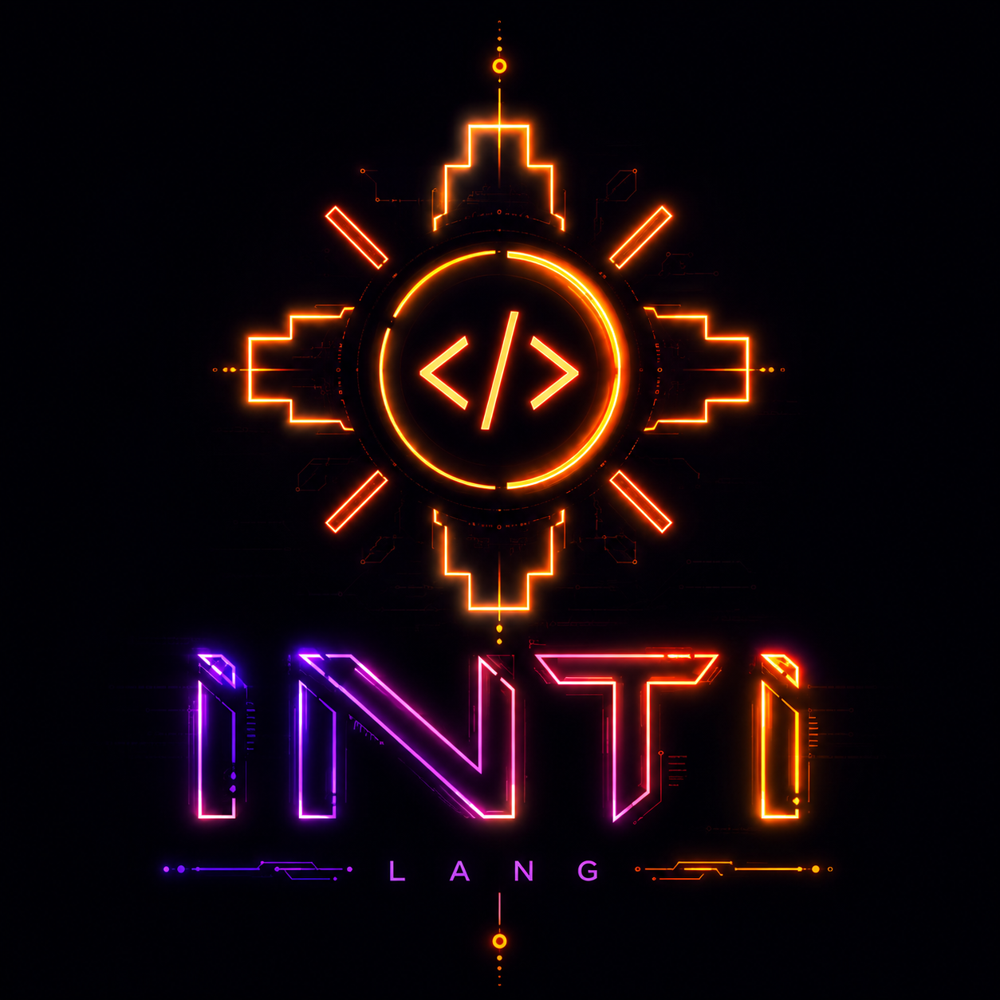

<p align="center">
  
</p>

# BMO-X

**A bare-metal orchestrator that boots on real hardware and runs COBOL, C, Ada
and INTI -- compiled by its own toolchain. No LLVM. No GCC. No QEMU.**


Written from scratch in Rust -- the boot chain, the kernel, the drivers, the
filesystem, and three native compilers. It boots on an AMD Ryzen 5 5600X and
occupies **5.4 MiB of 14.8 GiB of RAM**.

**1.596 commits - 1.064 files - 17 April to 23 August 2026 - one developer.**

---

## The one sentence

**Authority is functional, never inherited.** What a process may do comes from
the handles it holds -- not from who launched it, what it is called, or which
user is logged in. There is no `root` to inherit from and no ambient permission
to escalate into.

The teller's process does not *fail a check* on a large transfer. **The
operation does not exist for it.**

Everything below is a consequence of that sentence, and the four other clauses
that follow from it are in **[ARQUITECTURA.md](ARQUITECTURA.md)** with the
mechanism that implements each one -- because a principle with no mechanism
under it is a slogan.

---

## Read this first: the three states

| | State | Meaning |
|:--:|---|---|
| 🟢 | **Runs on metal** | Seen working on the real Ryzen, with a photo or a telemetry line |
| 🟡 | **Written, never executed** | Compiles, links, passes its tests -- and no CPU has ever run it |
| ⚪ | **Design only** | Documented, not built |

**Only 🟢 counts as done.** Nothing is green because it *should* work.

---

## 🟢 What the silicon has actually done

| | |
|---|---|
| Boots UEFI -> Ring 0 -> Ring 3 | kernel up at **47 ms**, first composed frame at **1.210 ms** |
| Runs its own compilers' output | COBOL, C and Ada binaries, launched from disk |
| Decimal arithmetic that is exact | a bank batch totalling `$1,135.00` from a file it read |
| USB keyboard and mouse | xHCI + HID written here, no BIOS help |
| Disk | AHCI, FAT32 read *and* write, plus ESTRATOS, its own copy-on-write volume |
| 12 cores | SMP bring-up, `12 of 12` |
| Ring 3 isolation | a fault kills the task; the kernel takes the screen back and prints its last four lines |
| Traps its own undefined behaviour | INTI `llano` on the Ryzen: overflow, divide-by-zero and bad conversion all caught **in metal** |

**The rescue that makes the rest safe**: `Ctrl+Alt+ESC` returns keyboard *and*
screen to the kernel from any program, checked at the one point in Ring 0 every
key passes through. A program that holds both cannot keep the machine hostage --
whether the cause is malice or a missing `if`.

Photographs, telemetry and the exact dates: **[AVANCES.md](AVANCES.md)**.

---

## Why it is built this way

Five decisions carry the whole design. Each is stated with what it costs,
because a trade-off with only one side written down is advertising.

**Two syscalls, frozen.** `INVOKE` and `WAIT`. Everything else -- opening a file,
reading the mouse, claiming the screen -- is an *operation* on a capability. The
API grows inside the pair (object kind, operation); the ABI does not move. The
proof it works is a number: **the operations went 22 -> 40 while the doors went
3 -> 2.** The system grew and the surface shrank.
*Cost*: every new ability needs a handle kind to hang from, so there is no quick
way to add "just one syscall".

**Its own compilers.** COBOL, C, Ada and INTI, straight to machine code and
BMO's own `.bex` container. No LLVM, no libc, no linker.
*Cost*: every bug in every language is ours, and a missing corner of C is found
by a program that dies, not by a spec.

**An abstraction may save you work; it may not lie.** An unimplemented feature is
**rejected with a reason, never stubbed to look like it works**. A global the
compiler cannot evaluate is an error rather than a silent zero. When `info`
reports 8.4 MiB, that number comes from the kernel and not from the program
claiming it.
*Cost*: more paths that say no, and more code to say why.

**Writing *is* committing.** ESTRATOS is copy-on-write: the audit trail is not a
logging product bolted on, it is what the filesystem leaves behind. The write
window is **named, per volume**, and the owner's Windows loader is outside every
one of them.
*Cost*: space, and a sealing step that has to be deliberate.

**Survive the fall.** A cat falls, breaks something, and walks away. Not the
absence of failure -- surviving it and being able to say what happened.
*Cost*: the kernel carries autopsy machinery it hopes never to use.

---

<p align="center">
  
</p>

## Why INTI exists

**INTI is the system language of BMO-X.** Python's syntax, assembly's control,
and a compiler that will not leave a single operation without a rule. It
compiles straight to `.bex`, it runs on the Ryzen, and its checks reach real
bytes -- not a document.

### C is not dead here. It was demoted.

C still compiles, is still tested, and stays. It is the only way to run the C
that already exists in the world, and that is worth keeping. What changed is
narrower and final: **BMO-X stops writing *new* system code in C.**

The reason is one clause C wrote in 1972 and never revisited. Undefined
behaviour was a *portability* bargain -- dozens of incompatible machines, tiny
compilers, and no honest way to say what a signed overflow meant on all of them
at once. It was the right trade **then**.

Fifty years later the clause had not moved, but what it bought had switched
sides: the compiler stopped reading it as *"anything may happen"* and started
reading it as *"this cannot happen, therefore I may delete the code around it."*
The programmer never agreed to the second reading. He inherited it.

And here the bargain has nothing left to buy: **one machine, one toolchain, and
every source in the tree.** There is no foreign compiler to stay compatible with
and no unknown architecture to hold the door open for. Keeping undefined
behaviour in BMO-X costs everything and purchases nothing.

### The evidence is from this house, not from a paper

The strongest argument for INTI was not argued. It was found:

| what the emulator did | what the silicon actually does |
|---|---|
| `cvttsd2si` **saturated** -- `1e30` gave the largest integer, NaN gave zero | returns the most negative value as a sentinel, for both |
| `imul` **set no flags** | sets `cf` and `of` when the product does not fit |

Both holes sat in the emulator for months while BMO C compiled against them, and
nobody noticed. **They surfaced the week INTI arrived, and the reason is exact:
BMO C never emits a `jo`.** There was no one to ask the question.

On **2026-08-22** the question was put to the real Ryzen 5 5600X. The probe line
`reglas` came back `0x00`: overflow trapped as `1001`, divide-by-zero as `1003`,
bad conversion as `1012`. **The emulator and the metal agree** -- which is the
only way "INTI has no undefined behaviour" stops being a claim about an emulator
we wrote ourselves.

### The cost, stated

The checks cost about **1%**. Three of the four rules that matter reach bytes and
run; the rest are 🟡 or ⚪ and the tracker says which. `INTI PLENO` -- text,
lists, tables, exact decimal -- **is not built**, and the compiler refuses to
emit a signed binary for it rather than emitting one that quietly returns zeros.

> The design is **[INTI_MAESTRO.md](docs/maestro/INTI_MAESTRO.md)**; who executes
> the cut is **[PLAN_EL_SILICIO.md](docs/plan/PLAN_EL_SILICIO.md)**; and
> **[ESTADO.md](toolchain/lang/inti/ESTADO.md)** takes the three claims apart and
> says which of them is paid for.

---

## What it deliberately does not do

No networking stack, no GPU driver, no dynamic linking, no processes talking
over sockets, no package manager, no accounts. Some of those are queued and some
are refused; **[ARQUITECTURA.md](ARQUITECTURA.md)** says which is which and why.

It is also not a Linux, not a hobby OS aiming at POSIX, and not trying to run
anybody else's binaries. A program for BMO-X is compiled for BMO-X.

---

## The second objective: **the day the card arrives, it gets profiled**

The primary objective is banking on BMO-X. This is the one behind it, and it is
stated here because the *shape* of the work is the point, not the hardware.

> **Target: AMD Radeon RX 9060 XT 16GB** (Navi 44 / GFX1200), declared
> 2026-08-02 in `platform/drivers/gpu/rdna4/`. A Ring 3 driver, like every other
> driver here.

### Why this is one day of work and not a project

**BMO-X profiles hardware. It does not write generic drivers.** That is the law
of the house, and it is why the estimate is not the one people expect:

```text
   hardware   ->  PROFILE    named exactly; swapping it swaps a table,
                             never an edit to the kernel
   software   ->  CONTRACT   names nobody, and therefore works for everyone
```

`amdgpu` is millions of lines because it supports fifteen years of cards:
runtime block discovery, dozens of firmware sets, a register map per generation,
power management for each. **That is the price of being generic, and it is not
paid here.** What gets written is one device id, one firmware set, one register
map. The same rule the CPU already follows -- *"swapping the CPU is a profile
swap, never a kernel edit"* (`cpu_vendor/profile.rs`).

The profile is also what makes the metal **testable**: it says *this card, this
MAC, this register*, so the answer can be written down before looking and then
compared. A driver that claims "any AMD card" has no experiment that can confirm
or refute it.

** So the arrival of the card is the trigger, and the work is filling in a
profile that is already written and already waiting -- `PROFILE.pci_devices` is
an empty list today, because **a profile refuses to claim a card it has never
met**.

### Why AMD, and it is not a preference

The RTX 3060 came first, and that path was **reverse engineering**. With AMD the
path is open, and that is the whole reason:

| | |
|---|---|
| firmware | published in `linux-firmware`, and **redistributable** |
| the RDNA ISA | **published by AMD** |
| a reference driver | `amdgpu` is open and **can be read** |

That turns the question from *"is it possible"* into *"how much"*.

### Two goals, kept apart on purpose

| | goal A | goal B |
|---|---|---|
| what | **SDMA**, the copy engine | command rings, compute, Vulkan |
| size | *"the size of the AHCI driver"* | the long road |
| why A is small | **the display is not touched**: it inherits the linear framebuffer UEFI left and skips DCN entirely | -- |
| what it buys | the compositor blit -- which at 1600x1000 is DOOM's **entire** deficit | Vulkan in Ring 3 |

Confusing *"make the blit fast"* with *"run Doom Eternal"* is the classic way to
finish neither.

### And the one piece that is honestly not measured

Goal B has a wall: the **PSP**, the security processor that authenticates the
microcode before the GPU will run. A profile shrinks *variants*; it does not
shrink a handshake.

**No number is given for it here, and that is deliberate.** The plan that
describes it says *"do not write a schedule for this until you have looked at
it"*, and the house rule is older than the plan: **a device is asked, never
assumed**. Measuring it costs a day of reading `amdgpu` and counting the steps
-- no hardware, no money -- and until that day the honest answer is *not
measured*, which is not the same as *long*.

The full reasoning: **[PLAN_VULKAN.md](platform/drivers/gpu/rdna4/PLAN_VULKAN.md)**
and **[PLAN_EL_ASISTENTE.md](docs/plan/PLAN_EL_ASISTENTE.md)**.

---

## How to be suspicious of it

The claim worth checking is not "it works" -- it is that the things marked 🟢
were seen on the real machine and the things marked 🟡 say so.

- `Ultra_kernel_x86-64\build.ps1 -BuildOnly` builds everything and runs the
  guards: sources are ASCII, and the syscall contract is compared across the
  kernel, the ABI and the userland runtime -- 49 operations, none by hand.
- `cargo test --workspace --exclude bmo-kernel` -- **2.167 tests**.
- `cargo test -p bmo-c-front probe_` -- **nine axes, 143 cells, half a second**:
  the census of what the C compiler actually supports, including the rows that
  are still broken. A census that hides its red rows is worth nothing.

**[CONTRIBUTING.md](CONTRIBUTING.md)** explains the bar for a change, and it is
mostly one rule: nothing that compiles and does not do what it says.

---

## Going deeper

This README is the summary on purpose. Everything under it has a document,
because the reason a decision was made is worth more than the decision.

| Document | What is in it |
|---|---|
| ★ **[EL_FUERO.md](EL_FUERO.md)** | **Start here if you want to build on BMO-X.** What the system grants you, what it demands back, and what it deliberately does not grant. Not an SDK -- a charter |
| **[META-KERNEL_HARD.md](META-KERNEL_HARD.md)** | The law of the machine. A rule exists only if it carries the component that demands it and the number it demands |
| **[META-APP_HARD.md](META-APP_HARD.md)** | The law of an app. What BMO-X demands of anything that wants to be one, and what it gives back |
| **[META-SDK_HARD.md](META-SDK_HARD.md)** | The law of **REX**: the nine `<bmo/...>` headers an app is written with, and the two tests that keep a library from becoming a framework |
| **[ARQUITECTURA.md](ARQUITECTURA.md)** | The full technical picture: layout, boot path, the operation table, the allocator, the complete status list |
| **[BITACORA.md](BITACORA.md)** | The build log, episode by episode. **Every bug that cost a day is written down with its root cause** |
| **[AVANCES.md](AVANCES.md)** | What is done, what is waiting for a boot, and the photographs |
| **[CONTRIBUTING.md](CONTRIBUTING.md)** | The bar, and what is frozen |
| [Ultra_kernel_x86-64](Ultra_kernel_x86-64/README.md) | Ring 0: boot chain, drivers, filesystems |
| [Ultra_userspace](Ultra_userspace/README.md) | Ring 3: the runtime and the compositor |
| [toolchain](toolchain/README.md) | The three compilers and the shared backend |
| [platform](platform/README.md) | The ABI, the `.bex` container, the drivers as crates |
| [docs/](docs/) | The master plans: audio, network, SMP, self-healing, DOOM, RAM |

---

## License

**Techne v2.0.** Read it before assuming: it is not MIT and it is not GPL.
See **[LICENSE.txt](LICENSE.txt)**.

---

Built from scratch in Lima, Peru, by **Eddi Salazar**.

<!-- TODO Eddi: enlaces a tu web, correo y al video -->
